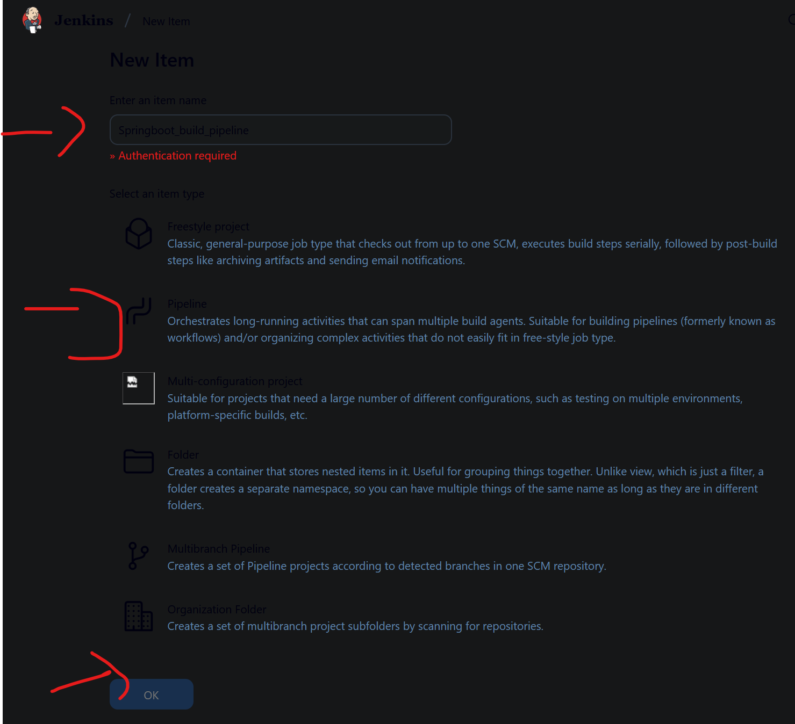

<html><body><h1 style="font-size:50px;color:blue;">Sameed Uddin</h1>
</body></html>

# PRODUCTION GRADE DEVSECOPS CICD Pipeline

**Author: Sameed Uddin**

## Prereq: Create 2 EC2 servers
- [ ] Build server with 15GB storage - t2.micro
- [ ] Sonarqube server with 4 GB memory - t2.medium

## Step 1: Ensure all the necessary plugins are installed in Jenkins Master
- [ ] Parameterized trigger plugin
- [ ] Gitlab plugin
- [ ] Docker Pipeline
- [ ] Pipeline: AWS steps
- [ ] SonarQube Scanner
- [ ] Quality Gates

## Step 2: Install Docker, Java17 & Trivy on Build Server
```
$ sudo ./setup.sh
```

## Step 3: Install Sonrqube on the t2.medium server
```
$ sudo apt update
$ sudo apt install -y docker.io
$ sudo usermod -a -G docker ubuntu
$ sudo docker run -d --name sonar -p 9000:9000 sonarqube:lts-community
```

## Step 4: Add necessary credentials
- [ ] Generate Sonarqube token of type "global analysis token" and add it as Jenkins credential of type "secret text"
- [ ] Add dockerhub credentials as username/password type
- [ ] Add Gitlab credentials 
- [ ] Add Build server credentials for Jenkins master to connect

## Step 4.1: Add Build Server as Jenkins Node
1. Go to Jenkins dashboard → Manage Jenkins → Manage Nodes and Clouds.
2. Click "New Node".
3. Enter a name (e.g., BuildServer), select "Permanent Agent", and click OK.
4. Fill in:
   - Remote root directory (e.g., `/home/jenkins`)
   - Number of executors (e.g., 1)
   - Labels (e.g., build)
   - Launch method: "Launch agents via SSH" and provide your build server's SSH credentials.
   - **Important:** Your build server must have Java 17 installed. Run:
     ```
     sudo apt update
     sudo apt install openjdk-17-jdk
     java -version
     ```
     Set JAVA_HOME to `/usr/lib/jvm/java-17-openjdk-amd64`.
5. Save and launch the agent.

## Step 4.2: Find PEM Key on Build Server
- PEM keys are usually stored in the `~/.ssh/` directory on your build server.
- To list PEM files, run:
  ```
  ls ~/.ssh/*.pem
  ```
- Use the PEM key for SSH authentication when adding the build server as a Jenkins node.

## Step 5: Enable Sonarqube webhook for Quality Gates & Install dependency-check plugin
- [ ] Generate webhook & add the Jenkins URL as follows - http://URL:8080/sonarqube-webhook/


